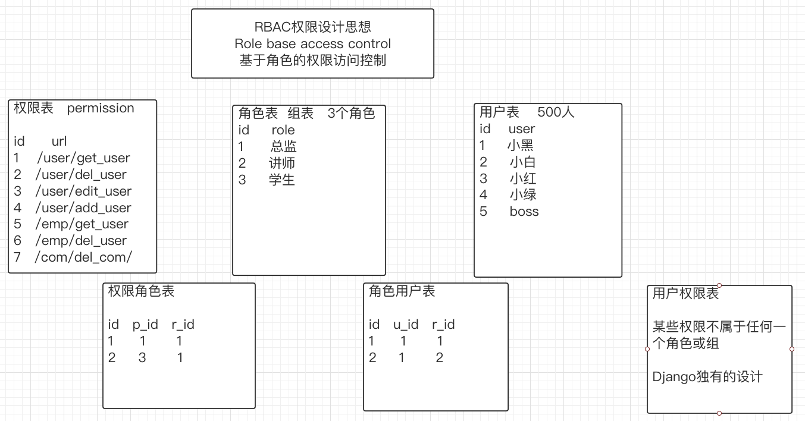

# DRF--day5

## 1. DRF三大认证组件

### 三大模块

#### 认证组件

> 认证入口：`self.perform_authentication(request)`
>
> 作用：主要用来校验当前访问者的身份信息   游客  合法用户  非法用户
>
> 游客：代表校验通过，直接进入下一步校验
>
> 合法用户：校验通过，可以进入下一步权限校验
>
> 非法用户：校验失败，抛出异常。返回非法用户403

#### 权限组件

> 权限入口：`self.check_permissions(request)`
>
> 作用：检验用户所拥有的权限，某些操作必须登录才能访问，所有用户、登录可写游客只读、自定义角色
>
> 认证通过：可以进入到下一步验证  频率
>
> 认证失败：抛出异常，返回403权限异常

#### 频率组件

> 频率入口：`self.check_throttles(request)`
>
> 作用：限制请求在规定时间内访问某个接口的次数
>
> 没有达到：可以正常访问
>
> 达到限次：限制时间内禁止再次访问此接口，限制时间超过后，可以重新访问

### Django权限设计

### 自定义权限表

> 继承`AbstractUser`，可以添加字段
>
> 用户表：角色groups  权限user_permissions
>
> 角色表：用户user_set  权限permissions
>
> 权限表：用户user_set  角色group_set

~~~python
# 自定义模型
from django.db import models
from django.contrib.auth.models import AbstractUser

class User(AbstractUser):
    phone = models.CharField(max_length=11, unique=True)

    class Meta:
        db_table = "api_user"
        verbose_name = "用户"
        verbose_name_plural = verbose_name

    def __str__(self):
        return self.username
    
# 配置django默认的user表  "app名字.模型名"
AUTH_USER_MODEL = "api.User"
~~~

~~~markdown
# 模型定义完成后进行迁移，如迁移过程中发生问题，按照以下步骤解决

1. 删除django.contrib下的admin、auth中的迁移记录  app中的迁移记录
2. 卸载django重新安装
3. 删除原有的sqllite文件
4. 重新执行迁移命令

# 可以通过视图进行权限之间相互访问
~~~

## 2. 认证模块

> 认证请求的身份

### 认证类源码

~~~python
# 认证器的核心源码
    def _authenticate(self):
        """
        Attempt to authenticate the request using each authentication instance
        in turn.
        """
        # 遍历认证器，获取到每一个认证器进行认证，self.authenticators:认证类对象
        for authenticator in self.authenticators:
            try:
                # 认证类方法有两个参数：一个是认证类对象本身  self是request对象
                user_auth_tuple = authenticator.authenticate(self)
            except exceptions.APIException:
                self._not_authenticated()
                raise

            # 对于认证后的返回值的处理  如果有返回值  就将当前登录用户的信息分别保存request.user request.auth
            if user_auth_tuple is not None:
                self._authenticator = authenticator
                self.user, self.auth = user_auth_tuple
                return

        # 如果返回值为空 则代表没有用户信息与认证信息
        self._not_authenticated()

~~~

### SessionAuthentication

~~~python
class SessionAuthentication(BaseAuthentication):
    def authenticate(self, request):
        # Get the session-based user from the underlying HttpRequest object
        # 从当前请求出解析出用户  不存在为None
        user = getattr(request._request, 'user', None)

        # Unauthenticated, CSRF validation not required
        if not user or not user.is_active:
            # 如果没有解析出用户或者用户信息不对 返回None
            return None

        # 解析出用户后，要重新启用csrf认证
        # 如果csrf认证失败 出现异常  非法用户
        self.enforce_csrf(request)

        # CSRF passed with authenticated user
        # 认证通过代表合法用户
        return (user, None)
~~~

### BasicAuthentication

~~~python
class BasicAuthentication(BaseAuthentication):
    www_authenticate_realm = 'api'

    def authenticate(self, request):

        # 获取认证信息  该认证信息是两段式  "basic 认证字符串"
        auth = get_authorization_header(request).split()

        # r如果没有认证信息  或信息不符合则是游客
        if not auth or auth[0].lower() != b'basic':
            return None

        # 有认证信息但认证信息不符合格式报错
        if len(auth) == 1:
            msg = _('Invalid basic header. No credentials provided.')
            raise exceptions.AuthenticationFailed(msg)
        elif len(auth) > 2:
            msg = _('Invalid basic header. Credentials string should not contain spaces.')
            raise exceptions.AuthenticationFailed(msg)

        try:
            auth_parts = base64.b64decode(auth[1]).decode(HTTP_HEADER_ENCODING).partition(':')
        except (TypeError, UnicodeDecodeError, binascii.Error):
            msg = _('Invalid basic header. Credentials not correctly base64 encoded.')
            raise exceptions.AuthenticationFailed(msg)

        # 从认证信息中处理出用户id  密码  进一步可得到用户对象
        userid, password = auth_parts[0], auth_parts[2]
        # 如果用户不存在  不是活跃用户代表非法  一切都正常才合法
        return self.authenticate_credentials(userid, password, request)
~~~

### 自定义认证类

> 1、创建认证器类并继承`BaseAuthentication`
>
> 2、重写`authenticate`方法完成认证逻辑
>
> 3、自定义规则对用户进行认证，进行全局配置局部配置

- 认证器使用方式

~~~python
# 全局配置
REST_FRAMEWORK = {
    # 系统默认的认证器配置
    'DEFAULT_AUTHENTICATION_CLASSES': [
        # 'rest_framework.authentication.SessionAuthentication',  # 基于会话
        # 'rest_framework.authentication.BasicAuthentication',     # Basic
        # 全局配置自定义认证器
        # 'api.authentications.MyAuth',
    ],
}

# 局部配置
authentication_classes = [MyAuth]
~~~

- 自定义认证器

~~~python
from rest_framework.authentication import BaseAuthentication
from rest_framework import exceptions

from api.models import User

"""
1.继承BaseAuthentication
2.重写authenticate方法
3.自定义规则
    没有认证信息返回None(游客)
    有认证信息但不符合(非法用户)
    有认证信息且认证成功  返回认证用户与信息元祖(合法用户)
4.配置认证器
"""

class MyAuth(BaseAuthentication):
    """
    在前端发送请求携带认证信息  必须按照一定的格式来
    默认使用Authorization携带认证信息
    认证信息都包含在 request.META字段中
    """

    # 重写authenticate
    def authenticate(self, request):
        # 获取认证信息
        auth = request.META.get('HTTP_AUTHORIZATION', None)
        print(auth)

        if auth is None:
            # 代表游客
            return None

        # 设置认证信息的校验规则   "auth 认证信息"
        auth_list = auth.split()

        # 校验规则：是否是合法用户  是不是两段式  如果第一个不是auth就错误
        if not (len(auth_list) == 2 and auth_list[0].lower() == "auth"):
            raise exceptions.AuthenticationFailed("认证信息有误，认证失败")

        # 如果认证成功 则解析用户  规定认证信息必须为abc.admin.123
        if auth_list[1] != "abc.marry.123":
            raise exceptions.AuthenticationFailed("用户信息校验失败")

        # 最后校验数据库是否存在此用户
        user = User.objects.filter(username="admin").first()

        if not user:
            raise exceptions.AuthenticationFailed("用户不存在")

        return (user, None)

~~~

## 3. 权限模块

> 入口：`self.check_permissions(request)`

#### 源码剖析

~~~python
# 权限的核心方法
    def check_permissions(self, request):
        """
        Check if the request should be permitted.
        Raises an appropriate exception if the request is not permitted.
        """
        # 遍历权限类获取到一个个的权限对象(权限器)  进行权限认证
        for permission in self.get_permissions():
            # 通过权限类的has_permission 进行权限认证
            # 参数：权限对象self  请求对象request  视图类对象
            # 如果有权限则返回True  无权限则返回False
            if not permission.has_permission(request, self):
                self.permission_denied(
                    request, message=getattr(permission, 'message', None)
                )
~~~

#### 系统权限类

~~~markdown
1. AllowAny
		has_permission()方法不做任何处理 直接返回True  所有请求均可访问
2. IsAuthenticated
		只允许认证通过的用户访问   游客无权访问
3. IsAdminUser 
		只允许后台管理员用户访问  游客没有权限  登录后的管理员才有权限
4. IsAuthenticatedOrReadOnly
		认证规则：已经认证成功的用户可以正常操作  游客只读
~~~

#### 使用方式

~~~python
# 全局配置
REST_FRAMEWORK = {
    # 权限类配置
    'DEFAULT_PERMISSION_CLASSES': [
        'rest_framework.permissions.AllowAny',
    ],
}

# 局部配置
 permission_classes = [IsAuthenticated]
~~~

#### 自定义权限类

> 1、继承`BasePermission`
>
> 2、实现`has_permission`方法，根据自定义规则实现权限，全局或局部配置

~~~python
from rest_framework.permissions import BasePermission

from api.models import User

class MyPermission(BasePermission):
    """
    有权限访问返回True
    无权限访问返回False
    登录可写  游客只读
    """

    def has_permission(self, request, view):
        # 如果是只读接口  则所有人都可以访问
        if request.method in ('GET', 'HEAD', 'OPTIONS'):
            return True

        username = request.data.get("username")
        # 如果用户访问的是写操作  判断用户是否有登录信息
        user = User.objects.filter(username=username).first()
        print(user)

        if user:
            return True
        return False
~~~

## 4. 频率模块 

> 频率入口：`self.check_throttles(request)`，主要用来限制一定时间内访问某个接口的次数

### 源码剖析

~~~python
    # 频率类核心方法
    def check_throttles(self, request):
        """
        Check if request should be throttled.
        Raises an appropriate exception if the request is throttled.
        """
        throttle_durations = []
        # 1. 遍历配置的频率认证类，初始化得到一个个频率类对象  会调用频率认证类  __init__(self)方法
        # 2. 频率认证类调用allow_request 方法，去判断是否限次 （限次不能访问  没有限次可访问）
        # 3. 频率认证类对象在限次后返回False，会调用wait()方法，获取还有多长时间可以进行下一次访问
        # 注意：所有的频率认证类都继承了SimpleRateThrottle
        for throttle in self.get_throttles():
            # 判断当前请求是否限次  限次返回False
            if not throttle.allow_request(request, self):
                # 一旦当前访问请求被限制了 返回False  调用wait() 返回接口下一次访问的剩余时间
                throttle_durations.append(throttle.wait())

        if throttle_durations:
            self.throttled(request, max(throttle_durations))
            
            
    # 对请求判断是否可以访问
    def allow_request(self, request, view):
        """
        Implement the check to see if the request should be throttled.

        On success calls `throttle_success`.
        On failure calls `throttle_failure`.
        """
        # self.rate 获取配置的访问频次  "3/60s"
        if self.rate is None:
            return True

        # self.get_cache_key(request, view) key: throttle_18500230996_1
        # 获取当前用户的唯一标识 并存到缓存里
        self.key = self.get_cache_key(request, view)
        if self.key is None:
            return True

        # 获取当前self.key访问频率的信息
        # 如果self.key是初次访问  self.history为空
        # 每次访问的时间self.history[0:10,0:12,0:50]
        self.history = self.cache.get(self.key, [])
        # 获取当前时间
        self.now = self.timer()

        # Drop any requests from the history which have now passed the
        # throttle duration
        # 判断当前时间与最后访问的时间  是不是大于配置的时间  1:10  4:20
        # 满足条件 则清除 不再累加
        while self.history and self.history[-1] <= self.now - self.duration:
            self.history.pop()
         # 如果self.history长度 大于 self.num_requests: 访问次数了  直接不允许访问
        if len(self.history) >= self.num_requests:
            return self.throttle_failure()

        # 如果历史访问此时没有达到限制次数 则可以正常访问
        return self.throttle_success()
    
    
    # 返回当前用户下一次可以访问此接口的剩余时间
    def wait(self):
        """
        Returns the recommended next request time in seconds.
        """
        if self.history:
            # 60s -  (当前时间 - 第一次访问时间)
            remaining_duration = self.duration - (self.now - self.history[-1])
        else:
            remaining_duration = self.duration

        available_requests = self.num_requests - len(self.history) + 1
        if available_requests <= 0:
            return None

        return remaining_duration / float(available_requests)
~~~

### 使用方式

~~~python
# 全局配置  一般都不会进行全局配置
REST_FRAMEWORK = {
    # 频率类配置
    'DEFAULT_THROTTLE_CLASSES': [],
    # Throttling
    'DEFAULT_THROTTLE_RATES': {
        'user': None,
        'anon': None,
    },
}

# 局部配置

~~~

### 自定义频率类

> 1、创建自定义频率类并继承`SimpleRateThrottle`
>
> 2、在类中设置一个`scope`类属性，属性名随意 
>
> 3、在settings中配置`DEFAULT_THROTTLE_RATES`访问次数，格式为`{"scope的属性名"："访问频次"}`
>
> 4、在自定义的类中提供`get_cache_key`方法

~~~python
# throttle.py

from rest_framework.throttling import SimpleRateThrottle

class SendMessageRate(SimpleRateThrottle):
    scope = "send"

    # 只对含有手机号的请求做验证
    def get_cache_key(self, request, view):
        phone = request.query_params.get("phone")

        # 没有手机号不做限制
        if not phone:
            return None

        # 返回数据  根据手机号动态展示返回的值
        return 'throttle_%(scope)s_%(ident)s' % {"scope": self.scope, "ident": phone}

# 全局配置访问频率
'DEFAULT_THROTTLE_RATES': {
    'user': "3/m",
    'anon': None,
    'send': "1/m",
},
    
class SendMessageAPIView(APIView):
    throttle_classes = [SendMessageRate]

    def get(self, request, *args, **kwargs):
        return APIResponse("读操作访问成功")

    def post(self, request, *args, **kwargs):
        return APIResponse("写操作")    
~~~

# 作业

~~~markdown
1. 掌握RBAC权限设计思想
2. 理解三大认证模块的源码
3. 掌握三大认证的使用方式
~~~

